<h1 align="center">
  🌐 Towards Spatio-Temporal World Scene Graph Generation<br>from Monocular Videos
</h1>

<p align="center">
  <strong>Rohith Peddi</strong>, <strong>Saurabh</strong>, <strong>Shravan Shanmugam</strong>, <strong>Likhitha Pallapothula</strong>, <strong>Yu Xiang</strong>, <strong>Parag Singla</strong>, <strong>Vibhav Gogate</strong>
</p>

<p align="center">
  <a href="https://arxiv.org/abs/2603.13185">
    
  </a>
  &nbsp;
  <a href="mailto:rohith.peddi@utdallas.edu">
    
  </a>
  &nbsp;
  <a href="#citation">
    
  </a>
</p>

<p align="center">
  <em>📧 For access to the ActionGenome4D dataset, please email <a href="mailto:rohith.peddi@utdallas.edu">rohith.peddi@utdallas.edu</a></em>
</p>

<p align="center">
  <sub>🔄 This page is under continuous update</sub>
</p>

---

## 📢 News & Updates

- **[June 2026]** — ActionGenome4D annotations, trained checkpoints, and VLM evaluation code release *(upcoming)*
- **[Mar 2026]** — Released the [arXiv paper](https://arxiv.org/abs/2603.13185) describing the WorldSGG framework.

---

## 📋 TODO — Upcoming Releases

- [ ] ActionGenome4D dataset annotations
- [ ] Trained model checkpoints (PWG, MWAE, 4DST)
- [ ] VLM / MLLM evaluation code
- [ ] 4D scene reconstruction pipeline code

---

## 🔍 Overview

### 1. World Scene Graph Generation (WSGG) Task
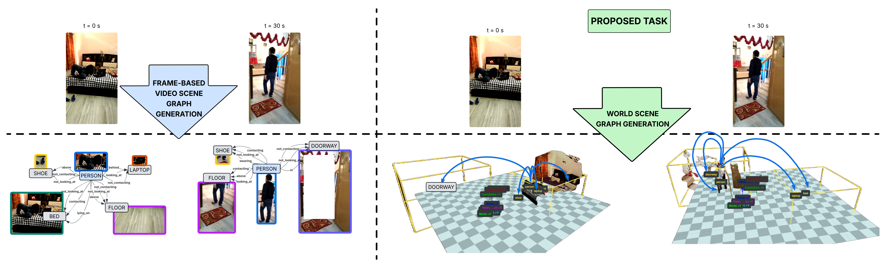

The **World Scene Graph Generation (WSGG)** task involves predicting 3D bounding boxes and relationship properties (such as attention, spatial proximity, and contact) for objects within a continuous 4D scene setup.

---

### 2. 4D Scene Pipeline
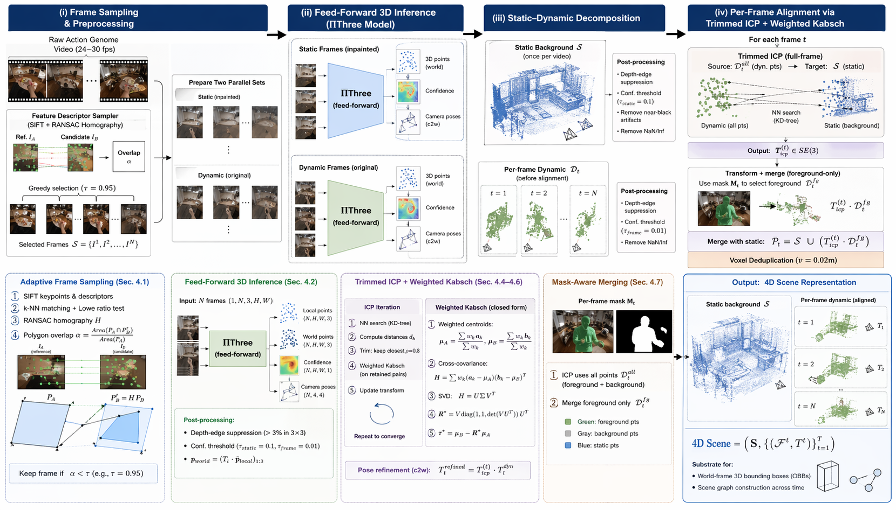

The **4D Scene Pipeline** processes monocular video to construct a comprehensive 4D representation of the environment, integrating motion features, camera pose, 3D object detection, tracking, and metric space projection of objects in the scene.

---

### 3. ActionGenome4D Dataset

An overview of the **ActionGenome4D** dataset, which provides rich 4D annotations for objects and their dynamic interactions over time across a variety of indoor environments.

<p align="center">
  <strong>Human Mesh Determination</strong><br>
  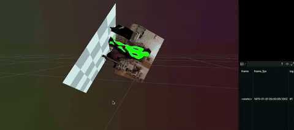<br>
  <sub>Human mesh estimation and determination for scene <code>0DJ6R</code></sub>
</p>

<p align="center">
  <strong>Static Scene Reconstruction</strong><br>
  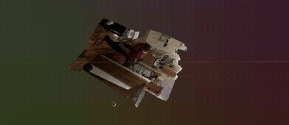<br>
  <sub>Static scene reconstruction with refined masks for <code>0DJ6R</code></sub>
</p>


---

### 4. Manual Relationship Correction

The **Manual Relationship Correction** interface allows for human-in-the-loop review and fine-grained modification of generated relationships, ensuring high-quality ground-truth annotations.

<p align="center">
  <strong>Scene Graph Corrector — Part 1</strong><br>
  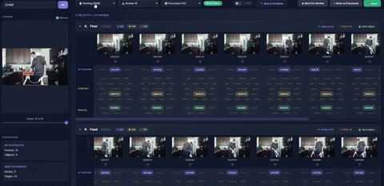<br>
  <sub>World scene graph relationship correction workflow</sub>
</p>

<p align="center">
  <strong>Scene Graph Corrector — Part 2</strong><br>
  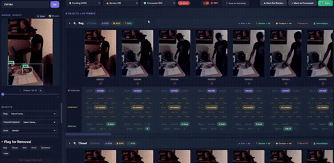<br>
  <sub>Continued scene graph correction and validation</sub>
</p>

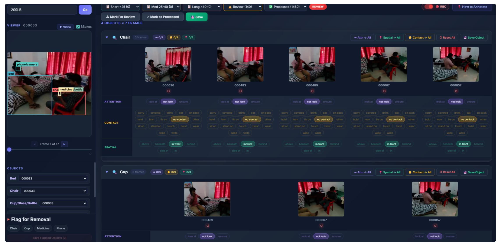

---

### 5. Manual 3D Floor Correction

The **Manual 3D Floor Correction** tool provides a 3D annotation interface for aligning reconstructed point clouds with the ground plane. Through a multi-step process of rotation and translation adjustments, annotators correct the floor alignment to ensure accurate world-frame coordinate systems for all objects in the scene.

<p align="center">
  <strong>Monocular 3D Annotations Corrections</strong><br>
  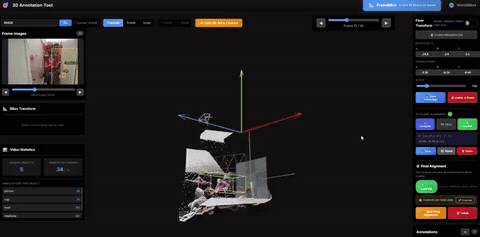<br>
  <sub>Correcting monocular 3D bounding box annotations</sub>
</p>

<p align="center">
  <strong>World Annotations Corrections</strong><br>
  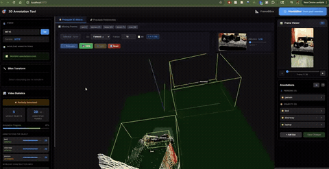<br>
  <sub>Correcting world-frame geometry annotations</sub>
</p>

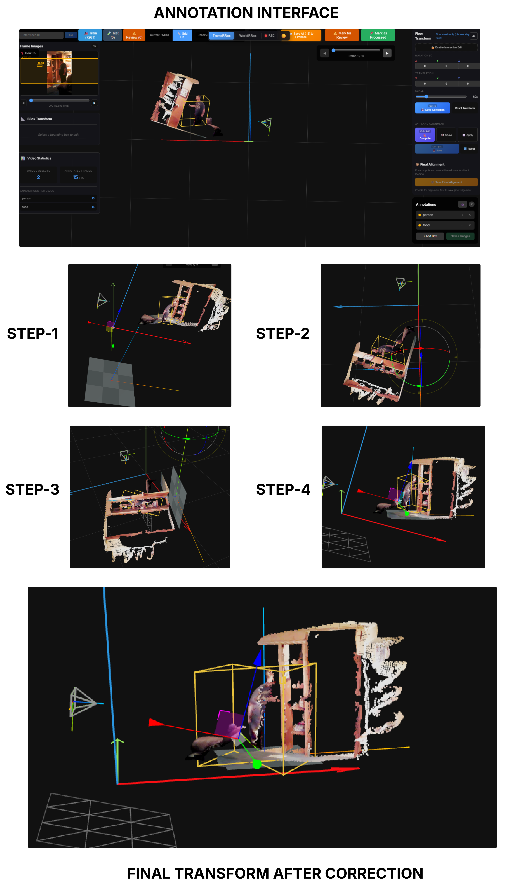

---

### 6. WSGG Model Pipeline
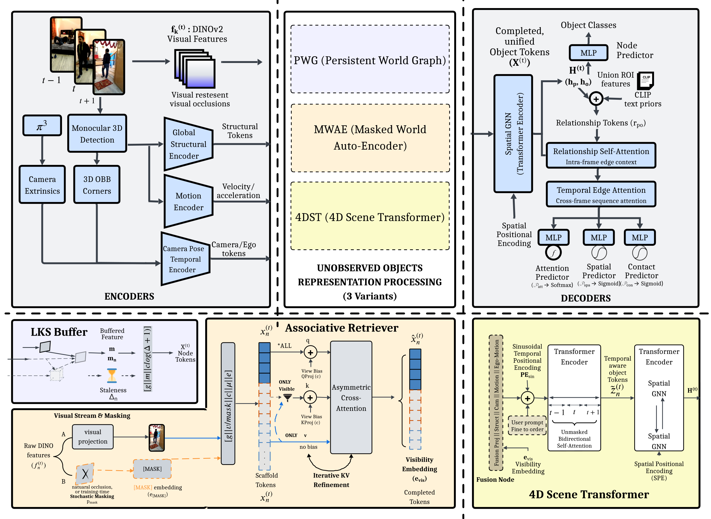

The **WorldSGG** architecture includes specialized encoders (structural, motion, camera pose), unobserved object representations (such as PWG, MWAE, and 4DST variants), and spatio-temporal decoders to predict complex object relationships in 4D.

---

### 7. MLLM Evaluation Pipeline
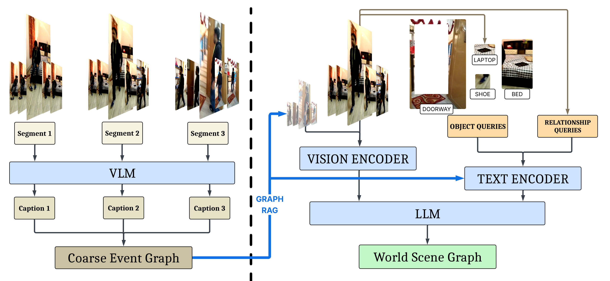

The **MLLM Pipeline** utilizes Vision-Language Models to generate coarse event graphs and employs Large Language Models powered by Graph RAG to infer continuous world scene graphs from video segments.

---

## 🙏 Acknowledgements

This code builds upon the following excellent repositories. We thank all the authors for releasing their code.

| Repository | Description |
|:---|:---|
| [Pi3](https://github.com/yyfz/Pi3) | 3D object detection |
| [PromptHMR](https://github.com/yufu-wang/PromptHMR) | Human mesh recovery |
| [Cut3R](https://cut3r.github.io/) | 3D scene reconstruction |
| [RAFT](https://github.com/princeton-vl/RAFT) | Optical flow estimation |
| [DepthAnything](https://github.com/DepthAnything/Depth-Anything-V2) | Monocular depth estimation |
| [UniDepth](https://github.com/lpiccinelli-eth/UniDepth) | Universal depth estimation |

---

## <a name="citation"></a>📄 Citation

If you find this work useful in your research, please consider citing:

```bibtex
@misc{peddi2026spatiotemporalworldscenegraph,
      title={Towards Spatio-Temporal World Scene Graph Generation from Monocular Videos}, 
      author={Rohith Peddi and Saurabh and Shravan Shanmugam and Likhitha Pallapothula and Yu Xiang and Parag Singla and Vibhav Gogate},
      year={2026},
      eprint={2603.13185},
      archivePrefix={arXiv},
      primaryClass={cs.CV},
      url={https://arxiv.org/abs/2603.13185}, 
}
```
