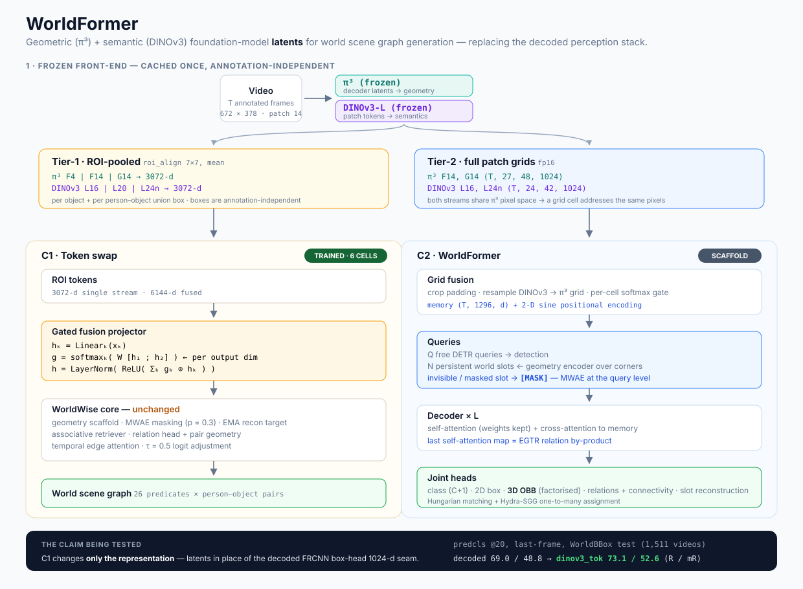

# WorldFormer — Geometric + Semantic Foundation Tokens for World Scene Graphs

WorldFormer is the WS3 expansion of the learning track: instead of consuming
the **decoded outputs** of the perception stack (FRCNN `box_head` appearance
vectors, π³-reconstructed point maps already collapsed into 3D boxes), the
model consumes the **latent tokens** of two frozen foundation models —
geometry from **π³** and semantics from **DINOv3** — and learns the world
scene graph on top of them.

The central claim is one ablation: *latents beat decoded outputs*. Everything
is staged so that claim is testable before the full architecture exists.

| Stage | What it is | Status |
|---|---|---|
| **C1 — token swap** | WorldWise with its single appearance seam re-pointed at cached frozen tokens. Isolates "latents vs decoded outputs" with *nothing else changed*. | trained (6 cells) |
| **C2 — WorldFormer** | Entity-query joint 3D detection + scene-graph generation over the fused token grids. MWAE lifted to the query level. | scaffold, smoke-tested |



Models: [c1_tokenswap/model.py](../lib/supervised/worldformer/c1_tokenswap/model.py) ·
[c2_worldformer/model.py](../lib/supervised/worldformer/c2_worldformer/model.py) ·
Caches: [datasets/preprocess/tokens/](../datasets/preprocess/tokens/) ·
Base method: [WORLDWISE.md](WORLDWISE.md) · Ladder: [BASELINES.md](BASELINES.md)

---

## 1. Why the seam is where it is

WorldWise already reads *everything* through pre-extracted per-video PKLs, and
all appearance enters through exactly two projectors:

```
ScaffoldTokenizer.visual_projector : Linear(d_detector_roi -> d_visual) -> ReLU -> LayerNorm
RelationshipPredictor.union_proj   : Linear(d_union_roi    -> d_rel/4)  -> ReLU -> LayerNorm
```

In the reference configuration those consume the **1024-d FRCNN box-head
output** of the monocular-3D detector ([MONOCULAR_3D_DETECTOR.md](MONOCULAR_3D_DETECTOR.md)),
i.e. a *decoded* representation: DINOv3 → FPN → RPN → ROI head → 1024-d. The
geometry the model sees (`corners_final`) is likewise decoded — π³ point maps
that the annotation pipeline already fitted into oriented boxes.

C1 changes only what flows through those two projectors. Because the geometry
scaffold, MWAE masking, EMA reconstruction target, associative retriever,
relation head and temporal edges are untouched, **C1 vs WorldWise@dinov3l is a
clean A/B on the representation**, not on the architecture.

---

## 2. Token caches (annotation-independent)

Both streams are cached once per video over *every* frame of
`frames_annotated/<video>.mp4`, which is a superset of what any feature or
annotation PKL uses — so the caches survive an annotation revision untouched.

```
/data3/rohith/ag/cache/tokens/<stream>/<split>/<video>.npz
                              + done_shard<k>of<n>.txt, status_shard<k>of<n>.json
```

| Stream | Model | Grid (Tier-2) | Hooked layers (Tier-1) |
|---|---|---|---|
| `dinov3l` | `facebook/dinov3-vitl16-pretrain-lvd1689m` (frozen) | `L16`, `L24n` — (T, 24, 42, 1024) fp16 on the /16-padded 672×384 image | `L16`, `L20`, `L24n` |
| `pi3` | `yyfz233/Pi3` (frozen) | `F14`, `G14` — (T, 27, 48, 1024) fp16 on the 672×378 π³ image, 5 register tokens stripped | frame `F4,F12..F16`, global `G13..G15` |

**π³ layer convention** (arXiv 2511.22686 §B.1, 0-indexed per attention type):
the decoder alternates frame (even block) and global (odd block) attention, so
frame layer *j* → decoder block *2j* and global layer *j* → block *2j+1*. The
resolved map is stored in every npz as `layer_blocks`.

**Image geometry is shared by construction.** Both streams resize with the
same `compute_target_size` (pixel limit 255 000, patch 14) used by
`extract_roi_features_base` and `pi3.utils.basic.load_images_as_tensor`, so a
π³ cell and a DINOv3 cell address the same pixels and ROI boxes pool
identically from either.

**Two tiers, deliberately:**

- **Tier-1** — ROI-pooled (`roi_align` 7×7, mean) per object *and* per
  person-object union box, for the boxes of the **existing feature PKLs**.
  Those boxes come from raw AG GT + GDino fill (predcls) or the DINOv3
  detector (sgdet) — neither depends on the world4d annotation revision.
  Kilobytes per object; this is what C1 consumes.
- **Tier-2** — the full patch grids for two layers per stream. Gigabytes;
  this is what C2 consumes, and what a future annotation revision with
  *different object boxes* would re-pool from (see §7).

**π³ frame indexing — deliberate off-by-one.** The existing π³ reconstructions
(`pi3_dynamic/<video>_10/predictions.npz`, the geometry the annotations were
built from) were produced by a loader that indexed the sorted frame list by
the sampled frame id, so clip index *k* corresponds to file `{id+1:06d}.png`.
`pi3_tokens.py` **reproduces that mapping** (verified MAE 0.0 against the
stored npz images, camera poses within 0.04) so cached latents stay in
register with the annotations. Both id lists are stored in each npz. Do not
"fix" this without regenerating the reconstructions.

Realised sizes: DINOv3 237 GB (test) + 852 GB (train); π³ 318 GB (test) +
1.2 TB (train).

---

## 3. Derived streams — `derive_roi_features.py`

Tier-1 tokens are assembled into drop-in replacements for the feature PKLs,
written in the **exact same schema** (`roi_features`, `union_features`,
`bboxes_xyxy`, `labels`, `label_ids`, `sources`, `pair_indices`,
`target_size`, and for sgdet `boxes_3d` / `assigned_labels` copied from the
reference PKLs), fp16:

| Stream | Contents | dim |
|---|---|---|
| `dinov3_tok` | concat(`L16`, `L20`, `L24n`) | 3072 |
| `pi3_tok` | concat(`F4`, `F14`, `G14`) | 3072 |
| `fused` | both, in that order | 6144 |

```
/data3/rohith/ag/cache/roi_derived/<mode>/<stream>/{train,test_worldbbox}/<video>.pkl
  symlinked to /data/rohith/ag/features/roi_features/<mode>/<stream>/{train,test,test_worldbbox}
```

so `WorldAG(feature_model="fused")` picks them up with no loader change. This
is also the **fast path for future annotation revisions**: the token grids never
move, only this derivation re-runs (CPU, ~1 h for both splits).

---

## 4. C1 — token swap

`WorldFormerC1` subclasses `WorldWise` and replaces the two projectors with a
`GatedFusionProjector` over K concatenated streams (`token_streams` config
key, which must sum to `d_detector_roi == d_union_roi`).

**Single stream** (`dinov3_tok`, `pi3_tok`) reduces *exactly* to the base form,
so the only difference from WorldWise is the input vector:

```
h = LayerNorm(ReLU(Linear_{3072 -> d}(x)))
```

**Two streams** (`fused`, `fusion: gated`) — a per-dimension softmax gate over
streams, so the model chooses geometry vs semantics per feature dimension
rather than committing to a fixed mixture:

```
h_k = Linear_k(x_k)                        k = 1..K,  h_k in R^d
g   = softmax_k( W [h_1 ; … ; h_K] )       g in R^{K x d}, softmax over K
h   = LayerNorm(ReLU( sum_k g_k * h_k ))
```

The mean per-stream gate of the last forward is kept in `last_gate_mean` and
exposed by `gate_summary()` — a free interpretability read on *how much of the
representation is geometric vs semantic*, per mode.

The EMA reconstruction target projector is deep-copied from the new projector
(so MWAE reconstruction targets live in the same space) and frozen.
`fusion: concat` (one `Linear` over the whole 6144-d vector) is the ablation
control for the gate.

Everything downstream — geometry scaffold, `p_mask_visible = 0.3` masking,
associative retriever, visibility embedding, inter-object transformer,
relation head with pair geometry, temporal edge attention, τ = 0.5 logit
adjustment, λ_vlm = 0 — is inherited unchanged from WorldWise v2e.

**Cells** (`configs/methods/{predcls,sgdet}/worldformer_c1_{dinov3tok,pi3tok,fused}_*.yaml`):
3 streams × 2 modes, 20 epochs, lr 1e-4, `train_annot_dir: world4d_rel_annotations`,
`test_annot_dir: world4d_rel_annotations_worldbbox`,
`save_path: /data3/rohith/ag/runs/worldformer`.

---

## 5. C2 — WorldFormer (entity queries over fused grids)

The joint-detection stage. Scaffold implemented and smoke-tested
(`tests/test_worldformer_c2_smoke.py`: 91/91 parameters receive finite
gradients); training is wired after C1 concludes.

```
DINOv3 grid (T,24,42,1024)  ─┐   crop pad ▸ resample to π³ grid
                             ├─► TokenGridFusion ─► memory (T, 1296, d)  + 2-D sine PE
π³ grid     (T,27,48,1024)  ─┘   per-cell softmax gate

free queries (Q, d)          ─┐
world slots  (N, d)          ─┤   slot = Linear(GlobalStructuralEncoder(corners))
   visible → Linear(cached ROI token)                       ├─► L × DecoderLayer ─► heads
   invisible (or p_mask'd) → [MASK]                         │      self-attn (weights kept)
                                                            ┘      cross-attn to memory
```

- **Grid fusion** — both streams are projected to `d_model`, the DINOv3 grid is
  cropped to its unpadded region and bilinearly resampled onto the π³ grid
  (legitimate because both live in π³ pixel space, §2), then combined by a
  per-cell 2-way softmax gate.
- **Queries** — `Q` free DETR queries carry detection; `N` **persistent world
  slots** are built from the world-graph geometry via the same
  `GlobalStructuralEncoder` WorldWise uses. This is **MWAE at the query
  level**: a slot that is not visible at frame *t* (or is artificially masked
  with probability `p_mask_visible`) receives the learnable `[MASK]` token
  instead of its appearance, and the decoder must recover it from the image
  and the other slots. Object permanence becomes a property of the query set
  rather than a post-hoc buffer.
- **Decoder** — `L` layers of self-attention over all queries (weights
  returned), cross-attention to the fused memory, FFN. The last layer's
  self-attention map is the **EGTR-style relation by-product**: relations are
  read out of attention the detector already computes, not from a separate
  triplet-query stack.
- **Heads** — class (C+1 with no-object), 2D box (cxcywh, sigmoid), **3D OBB
  through the factorised parameterisation of the existing detector**
  (`_compute_3d_corners` from `dino_mono_3d`: dims / yaw sin-cos / depth /
  centre offset, pinhole back-projection with f = max(H, W)), relation head
  over query pairs `[q_i ; q_j ; q_i ⊙ q_j ; A_ij]` → 26 predicate logits +
  connectivity, and a reconstruction head for masked slots.
- **Matching** — Hungarian on class + L1 box + L1 corners, with optional
  **Hydra-SGG-style one-to-many** auxiliary assignment (every unmatched query
  whose box IoU with a GT exceeds a threshold), train-time only: the standard
  remedy for DETR's slow convergence on a small dataset.
- **Loss** — `CE(class, no-object ×0.1) + 5·L1(box) + L1(corners) + BCE(relations
  over matched GT pairs) + 0.5·MSE(reconstruction of masked slots)`.

---

## 6. Results

C1 cells on the WorldBBox test split (1,511 videos). The reference is
WorldWise v2e @ dinov3l — the same model reading decoded FRCNN features.

**Trainer (online, last-frame) metrics, with-constraint @ K=20:**

| Cell | epoch | predcls R / mR | sgdet R / mR |
|---|---|---|---|
| WorldWise@dinov3l *(reference, last-frame)* | 20 | 69.0 / 48.8 | — |
| `dinov3_tok` | 20 | **73.1 / 52.6** | 55.8 / 25.4 |
| `pi3_tok` | in progress | 70.0 / 48.6 @ ep5 | 53.3 / 21.3 @ ep3 |
| `fused` | in progress | 70.5 / 48.3 @ ep3 | 53.8 / 21.3 @ ep2 |

The finished `dinov3_tok` cell is **+4.1 R / +3.8 mR over the decoded-feature
reference** on the comparable last-frame protocol — the first direct evidence
for the latents-vs-decoded claim. The π³ and fused cells are only a few epochs
in (`dinov3_tok` itself read 68.2 / 36.3 at epoch 1 and finished at 73.1 /
52.6), so their final standing is open.

**These are last-frame numbers and are not comparable to the all-frame
reference table** ([analysis/worldbbox_reference_2026-09-17.md](../analysis/worldbbox_reference_2026-09-17.md)).
The definitive all-frame + visibility-bucket numbers come from the C4 scoring
chain (`scripts/remote/score_worldformer_c1.sh`), which runs automatically
once all six cells reach epoch 20 and writes to
`/data3/rohith/ag/runs/worldformer/score/`.

**Ablations the design supports** (mostly free, since the cells already exist):
stream identity (`dinov3_tok` vs `pi3_tok` vs `fused`) · fusion mechanism
(gated vs concat) · gate statistics per mode (`gate_summary()`) · layer
selection within a stream (re-derive only) · C1 vs WorldWise@dinov3l vs the
resnet50/dinov2 ladder · with/without MWAE on the token substrate.

---

## 7. Files, and what is still open

| Component | Path |
|---|---|
| Cache helpers / video + frame lists / Tier-1 pooling | `datasets/preprocess/tokens/token_common.py` |
| DINOv3 cacher | `datasets/preprocess/tokens/dinov3_tokens.py` |
| π³ cacher (hooks, register-token strip, off-by-one) | `datasets/preprocess/tokens/pi3_tokens.py` |
| Derived feature PKLs + symlinks | `datasets/preprocess/tokens/derive_roi_features.py` |
| C1 model | `lib/supervised/worldformer/c1_tokenswap/model.py` |
| C2 scaffold + matching + loss | `lib/supervised/worldformer/c2_worldformer/model.py` |
| Training launcher (multi-GPU, one job per cell) | `tools/run_configs_multigpu.py`, `scripts/remote/run_worldformer_c1_train.sh` |
| Scoring chain (dump → reeval → buckets → tables) | `scripts/remote/score_worldformer_c1.sh` |
| Pipeline / score watchers (overnight automation) | `scripts/remote/worldformer_{pipeline,score}_watcher.sh` |
| Manifest registration | `tools/register_token_cache.py`, `tools/cache_manifest.py` |
| Tests | `tests/test_worldformer_c1_{smoke,realdata}.py`, `tests/test_worldformer_c2_smoke.py` |

**Open items**

1. **Tier-2 re-pooling path is not implemented.** `derive_roi_features.py`
   pools Tier-1 vectors that were cached against the *existing* feature-PKL
   boxes. If the annotation audit (WS4) changes object sets, new boxes need
   pooling from the stored grids — only `L16/L24n` and `F14/G14` grids exist,
   so a re-pool is restricted to those layers unless the cachers re-run.
2. **π³ caching is GPU-bound** (~4.5 clip-frames/s): the pip package ships
   without the CUDA `curope` extension, so RoPE falls back to PyTorch.
3. **C2 is untrained.** The scaffold runs forward/backward on real batches;
   the S1 (detection-only) → S2 (relations) → S3 (LoRA on π³) staging in
   `docs/ICLR_PLAN.md` is the plan, and the honest fallback for the deadline
   is shipping C1 with C2 as the architectural proposal.
4. **C1 must beat its own single-stream cells, not just the reference** — if
   `fused` does not beat `max(dinov3_tok, pi3_tok)`, the gate is not earning
   its parameters and `concat` should be reported instead.
