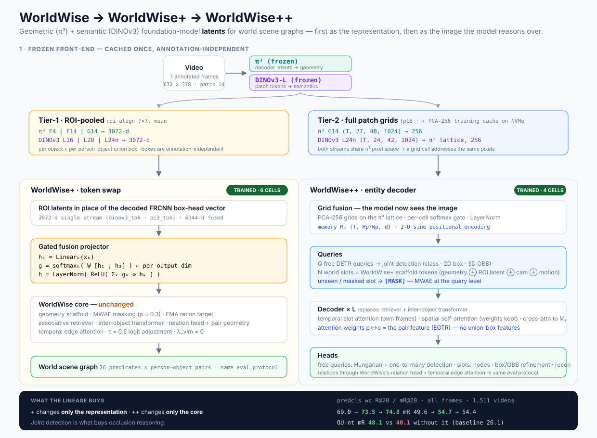

# WorldWise++ — an image-grounded entity decoder with joint detection

Track: [TRACK1_TRAINING.md](TRACK1_TRAINING.md) · index: [README.md](README.md)

WorldWise++ is the architectural step of the lineage. WorldWise and
WorldWise+ never see an image: they reason over a fixed set of object slots
whose appearance was pooled by someone else, and object permanence lives in a
separate module (the associative retriever) bolted between the tokenizer and
the inter-object transformer. WorldWise++ keeps the WorldWise scaffold, loss
recipe and evaluation protocol, and replaces the object-token core with a
single **entity decoder** that

1. **sees the image** — cross-attends to the fused DINOv3 / π³ token grid of
   every frame (WorldWise+'s latents, but the *whole* grid, not only the
   pooled ROI);
2. **does permanence and inter-object reasoning in one place** — each decoder
   layer attends over a slot's own frames (temporal), over all entities of the
   frame (spatial), and into the grid (cross), so a masked slot is recovered
   from its own visible frames *and* from the current image;
3. **detects jointly** — free DETR queries are trained with Hungarian matching
   to detect objects (class, 2-D box, 3-D OBB) from the same grid, and the
   world slots refine their own boxes;
4. **reads relations out of attention** — the pair features for the relation
   head are the decoder's own spatial attention weights (EGTR-style), so no
   union-box ROI features are needed anywhere.

| Variant | Appearance input | Object-token core | Detection |
|---|---|---|---|
| WorldWise | decoded FRCNN box-head (1024-d) | scaffold → retriever → inter-object transformer | none (external detector) |
| WorldWise+ | frozen DINOv3 / π³ ROI latents | unchanged | none |
| **WorldWise++** | + full DINOv3 / π³ token grids | **entity decoder** (temporal · spatial · cross) | **joint** (free queries + slot refinement) |



Model: [lib/supervised/worldwise_pp/model.py](../lib/supervised/worldwise_pp/model.py) ·
Loss: [lib/supervised/worldwise_pp/loss.py](../lib/supervised/worldwise_pp/loss.py) ·
Dataset: [lib/supervised/worldwise_pp/dataset.py](../lib/supervised/worldwise_pp/dataset.py) ·
Grid cache: [datasets/preprocess/tokens/build_pp_grid_cache.py](../datasets/preprocess/tokens/build_pp_grid_cache.py) ·
Method key `worldwise_pp` · Base: [WORLDWISE_PLUS.md](WORLDWISE_PLUS.md), [WORLDWISE.md](WORLDWISE.md)

---

## 1. Forward pipeline

```
                 ┌──────────────── WorldWise / WorldWise+ front-end, unchanged ────────────────┐
corners ──► GlobalStructuralEncoder ─┐                                                          │
poses ───► ObjectSpatialEncoder      ├─► ScaffoldTokenizer ──► N world-slot tokens  s_t,n         │
       └─► CameraTemporalEncoder     │     visible slot : gated projector(DINOv3 ROI latent)      │
corners ──► ObjectMotionEncoder      │     unseen / p_mask=0.3 : [MASK]      (EMA recon target)   │
DINOv3 ROI latents (3072-d) ─────────┘                                                          │
                 └──────────────────────────────────────────────────────────────────────────────┘

DINOv3 L24n grid ─┐  PCA-256, π³ lattice          ┌────────────────────────────────────────────┐
                  ├─► TokenGridFusion ──► M_t     │  Entity decoder  × L                        │
π³ G14 grid ──────┘  per-cell gate + 2-D sine PE  │   (a) temporal self-attn   slot n over t   │
                                                  │   (b) spatial  self-attn   all queries of t │  weights kept
Q free queries q_t,q  ────────────────────────────┤   (c) cross-attn           queries → M_t   │
N slot tokens  s_t,n  ────────────────────────────┤   (d) FFN                                   │
                                                  └───────────────┬────────────────────────────┘
                                                                  │
      free queries ───► class (C+1) · 2-D box · 3-D OBB  ──► Hungarian + one-to-many  (detection)
      world slots  ───► + VisibilityEmbedding ──► NodePredictor · reconstruction_proj · box/corner refinement
      slot pairs   ───► [ attention weights p↔o over all layers ; q_p ⊙ q_o ] ──► replaces union features
                        ──► RelationshipPredictor (text ⊕ pair geometry ⊕ rel self-attn)
                        ──► TemporalEdgeAttention ──► attention / spatial / contacting
```

Everything above the first box and to the right of the decoder is WorldWise
code, called with the same tensors; the output dict has the same keys as
`WorldWise.forward` (plus a `det` sub-dict), so `WorldWiseLoss`, the trainer,
`tools/dump_predictions.py` and `tools/reeval_test.py` run unchanged.

---

## 2. Grid inputs — the PCA-256 training cache

The Tier-2 grids ([WORLDWISE_PLUS.md](WORLDWISE_PLUS.md) §2) are 2.6 TB on a
spinning disk that reads at ~140 MB/s; one training epoch over them would be
~2 h of I/O. WorldWise++ therefore trains from a compact cache built once by
`build_pp_grid_cache.py`:

- **one layer per stream** — DINOv3 `L24n` (final, normalised) for semantics,
  π³ `G14` (global-attention layer: geometry with cross-frame context);
- **one lattice** — the DINOv3 grid is cropped to its unpadded region and
  bilinearly resampled onto the π³ grid, exactly as the online fusion would
  have done (both streams live in π³ pixel space, so the cells coincide);
- **frozen PCA 1024 → 256 per stream**, fit on train tokens only (150 videos,
  ~500 k tokens per stream); the retained variance is stored with the basis
  (`pca_dinov3_L24n.npz`, `pca_pi3_G14.npz`) and reported in the appendix;
- only the frames the loader uses, fp16, on NVMe:

```
/data3/rohith/ag/cache/pp_grids/<split>/<video>.npz    (→ NVMe /code)
   frames (T,)  dino (T,Hp,Wp,256) f16  pi3 (T,Hp,Wp,256) f16  grid_hw (Hp,Wp)  target_size (H,W)
```

≈ 32 MB per video, ≈ 290 GB for train + test, a few minutes of I/O per
epoch. The cache is annotation-independent (registered in the manifest): an
annotation revision changes object sets and pairs, never these grids.

`WorldAGGrid(WorldAG)` attaches `grid_dino`, `grid_pi3`, `image_hw` to the
standard per-video batch (rows selected by `frame_names`, in loader order).

---

## 3. Components

**Front-end (unchanged from WorldWise+).** Geometry, camera, ego-motion and
motion encoders; `ScaffoldTokenizer` with the `GatedFusionProjector` over the
DINOv3 Tier-1 tokens (`feature_model: dinov3_tok`, `token_streams: [3072]`);
`[MASK]` for unseen slots and `p_mask_visible = 0.3` artificial masking; EMA
reconstruction target. The slot tokens *are* the world-slot queries.

**TokenGridFusion.** Per stream `LayerNorm → Linear(256 → d_model)`; a
per-cell 2-way softmax gate mixes the two projections; LayerNorm; plus a 2-D
sine positional encoding computed for the video's own grid size (grids vary
with aspect ratio). Output: memory `M_t ∈ R^{Hp·Wp × d}` per frame.

**Queries.** `n_free_queries` learnable (content + position) free queries per
frame, and the N world slots with a positional embedding derived from the
structural token (`Linear(GlobalStructuralEncoder(corners))`). Padded slots are
masked out of every attention and zeroed after every layer, as in WorldWise.

**Entity decoder (× `n_decoder_layers`, pre-norm).**

| step | attends | purpose | replaces |
|---|---|---|---|
| (a) temporal self-attention | slot *n* across the T frames (+ learned frame embedding), slots only | a masked / unseen slot reaches its own visible frames | `AssociativeRetriever` |
| (b) spatial self-attention | all free queries + slots of frame *t*; weights returned per head | inter-object reasoning; **relation by-product** | `InterObjectTransformer` |
| (c) cross-attention | queries → `M_t` | image grounding: appearance beyond the ROI, context, detection | — (new) |
| (d) FFN | | | |

**Heads.**

- *Free queries* → class (C+1 with no-object), 2-D box (cxcywh, sigmoid),
  3-D OBB through the factorised parameterisation of the existing monocular
  detector (`_compute_3d_corners`: dims / yaw sin-cos / depth / centre offset,
  pinhole with f = max(H, W)).
- *World slots* → `+ VisibilityEmbedding` → `NodePredictor` (object classes;
  GT override in predcls exactly as WorldWise), `reconstruction_proj` (MWAE
  reconstruction now passes through the decoder), and a **refinement head**
  predicting residuals on the slot's 2-D box and 3-D corners — the joint
  detection on the persistent world graph.
- *Relations* — for each (person, object) pair the spatial attention weights
  in both directions from every layer (2·L·heads values) and `q_p ⊙ q_o` are
  projected to `d_rel / 4` and fed to `RelationshipPredictor` **in place of
  the union-box features**; text pathway, pair geometry, relation
  self-attention, `TemporalEdgeAttention` and the three heads are WorldWise's.

**Matching.** Per frame, Hungarian assignment of free queries to the frame's
GT objects (valid & visible slots with a GT box: cost = class prob + 5·L1 box
+ L1 corners), plus the Hydra-SGG one-to-many auxiliary assignment (every
unmatched query whose box IoU with a GT exceeds 0.5) at train time — the
standard remedy for DETR's slow convergence on a small dataset.

---

## 4. Loss

```
L = L_WorldWise                                   (unchanged: λ_vlm = 0, τ = 0.5 logit adjustment,
                                                    simulated-unseen + EMA reconstruction, node CE)
  + λ_det  · [ CE(class, no-object × 0.1) + 5·L1(box) + L1(corners) ]      free queries, matched
  + λ_slot · [ L1(box residual) + L1(corner residual) ]                   valid & visible slots
```

`λ_det = λ_slot = 1` in the main cells. The scene-graph part of the objective
is byte-identical to WorldWise and WorldWise+, so differences in R / mR are
attributable to the architecture and the detection objective, not to the
loss recipe.

---

## 5. Evaluation — same protocol, plus detection

Scene graphs are scored exactly as for every other method: the same object
slots and person–object pairs from the feature PKLs, the same
`dump_predictions → reeval_test → bucketed_breakdown` chain on the WorldBBox
test split (1,511 videos, all frames, wc/nc R@K and mR@K, OO / OU /
OU-non-trivial buckets). WorldWise++'s free-query detections are **not**
substituted into the protocol — that would change what sgdet measures — they
are reported separately (2-D AP / recall against the GT boxes) as the joint
detection result.

---

## 6. Cells and compute

| Experiment | Mode | GPU | What it isolates | Status |
|---|---|---|---|---|
| `worldwise_pp_dinov3_predcls` | predcls | 0 | the headline — WorldWise++ @ DINOv3 | done 20/20 |
| `worldwise_pp_dinov3_sgdet` | sgdet | 1 | idem | done 20/20 |
| `worldwise_pp_dinov3_nodet_{predcls,sgdet}` | both | 2 | `n_free_queries = 0`, `λ_det = λ_slot = 0`: the decoder without the detection objective | done 20/20 |

Config source: `tools/gen_worldwise_variant_configs.py` (from the
`worldwise_plus_dinov3tok_*` cells: 20 epochs, lr 1e-4, AMP, `d_model 256`,
`n_decoder_layers 4`, `n_decoder_heads 8`, `n_free_queries 30`,
`det_one_to_many_iou 0.5`, `save_path /data3/rohith/ag/runs/worldwise_pp`).
Launcher `scripts/remote/run_worldwise_pp_train.sh`; scoring
`scripts/remote/score_worldwise_variants.sh` (CPU, best epoch, dump → reeval
→ buckets) feeding the comparison table below.

**Throughput note.** These cells are dataloader-bound, not GPU-bound: each
item re-reads two PKLs plus ~32 MB of grids. With the trainer's historical
`num_workers=0` the SGDet cell ran at 3.2 s/video with the GPU at 0-5 %
(≈5.5 days for 20 epochs); with `num_workers: 4` + `prefetch_factor: 4` it
runs at ~1.7 it/s. Keep those keys set in any new cell.

---

## 7. Results

**All-frame, best epoch, WorldBBox test (1,511 videos)**, same protocol and
scripts as every other row of
[analysis/worldbbox_lineage_2026-09-19.md](../analysis/worldbbox_lineage_2026-09-19.md).
All four cells trained the full 20 epochs.

**PredCls**

| Model | wc R@20 | wc mR@20 | nc R@20 | nc mR@20 | OO R@20 | OU R@20 | OU-nt R@20 | OU-nt mR@20 |
|---|---|---|---|---|---|---|---|---|
| Best baseline (W-DSGDetr++) | 68.5 | 38.9 | 92.7 | 71.0 | 91.4 | 77.0 | 55.3 | 26.1 |
| WorldWise @ dinov3l | 69.0 | 49.6 | 92.6 | 82.4 | 90.9 | 80.5 | 72.9 | 41.1 |
| WorldWise+ @ dinov3tok | 73.5 | **54.7** | 94.3 | 85.6 | 93.4 | 81.4 | 76.0 | 45.2 |
| **WorldWise++** | **74.8** | 54.4 | **94.6** | **86.2** | **93.6** | **82.5** | **76.6** | **48.1** |
| WorldWise++ `nodet` | 74.1 | 54.3 | 94.2 | 86.0 | **93.6** | 79.7 | 75.0 | 40.1 |

**SGDet**

| Model | wc R@20 | wc mR@20 | wc mR@50 | nc R@20 | nc mR@20 | OU-nt R@20 | OU-nt mR@20 |
|---|---|---|---|---|---|---|---|
| Best baseline (W-DSGDetr / ++) | **56.6** | 20.3 | 35.4 | 63.8 | 31.2 | 14.3 | 7.7 |
| WorldWise @ dinov3l | 52.6 | 21.5 | 38.8 | 57.1 | 37.5 | 28.1 | 21.3 |
| WorldWise+ @ dinov3tok | 54.2 | 23.1 | 45.5 | 58.6 | 43.3 | 26.6 | 20.5 |
| **WorldWise++** | 54.6 | **24.5** | **48.6** | 59.4 | **44.1** | **27.8** | **22.3** |
| WorldWise++ `nodet` | **54.8** | 24.1 | 48.4 | **59.5** | 43.9 | 27.7 | 21.9 |

### What the results establish

1. **WorldWise++ is the strongest model in the lineage on recall.** PredCls
   wc R@20 74.8 is **+6.3 over the best baseline** and +1.3 over WorldWise+;
   it also takes both no-constraint columns and every occlusion bucket. The
   ladder 68.5 -> 69.0 -> 73.5 -> 74.8 is monotone.
2. **The detection objective is what buys occlusion reasoning.** The `nodet`
   ablation is the decisive cell: removing the free queries and the
   box/corner refinement costs **8.0 mR@20 on the occluded non-trivial bucket
   in PredCls (48.1 -> 40.1)** and 1.6 R on OU, while barely moving the
   headline numbers (74.8 -> 74.1 R). Learning to *localize* is what teaches
   the slots to reason about objects the camera cannot see — which is the
   paper's central claim, and it is supported by an ablation rather than an
   assertion.
3. **Mean recall has plateaued.** WorldWise+ 54.7 -> WorldWise++ 54.4 in
   PredCls is flat-to-slightly-down. The mR gains in this line of work came
   from the loss recipe (WorldWise) and the representation swap
   (WorldWise+); the architecture change buys recall, no-constraint
   performance and occlusion, not tail recall. SGDet is the exception, where
   ++ does take mR@20 (24.5) and mR@50 (48.6) outright.
4. **WorldWise++ repairs WorldWise+'s SGDet occlusion regression.**
   WorldWise+ @ dinov3tok had fallen *below* the decoded reference on the
   unobserved buckets (26.6 / 20.5 vs 28.1 / 21.3). WorldWise++ recovers to
   27.8 / **22.3**, the best OU-nt mR of any model including WorldWise.
   Giving the slots direct access to the image is what closed it.
5. **SGDet wc-R remains the one baseline-favouring column** (56.6 vs 54.6).
   The gap narrowed across the lineage (52.6 -> 54.2 -> 54.6) but did not
   close. Present SGDet on mR, no-constraint and the occlusion buckets, where
   ++ leads by 2-3x on the buckets and by ~13 points on mR@50.

**A caveat worth keeping.** Both `nodet` cells edge out the full model on
SGDet wc R@20 (54.8 vs 54.6) and nc R@20 (59.5 vs 59.4) — differences well
inside noise, but they mean the detection objective's benefit in SGDet is
specific to mR and the occluded buckets, not a uniform win.

**Not yet measured:** the free queries' own detection quality (2-D AP /
recall against the GT boxes). The heads are trained and the numbers above
depend on them, but detection is not yet reported as a standalone result.

## 8. Ablations the design supports, and open items

Free with the cells above: with / without the detection objective (`nodet`)
· WorldWise++ vs WorldWise+ (grid + decoder) vs WorldWise (representation).
Cheap to add: cross-attention off (decoder without the image → a
WorldWise+-like model with a different core), temporal step off (permanence
from the image only), EGTR readout vs union tokens, `n_free_queries`.

Open:

1. **Free-query detection quality is still unreported.** The heads are
   trained and the `nodet` ablation shows they matter (OU-nt mR 48.1 vs 40.1),
   but the standalone 2-D AP / recall of the free queries has not been
   measured. DETR-style heads converge slowly from frozen features on ~184 k
   frames, so 20 epochs may under-train them; report the number honestly once
   measured, even if it is weak — the scene-graph results do not depend on it
   being strong.
2. **PCA-256 is a compromise** forced by disk throughput; the retained
   variance is logged and the full-rank grids remain cached for a re-run on
   faster storage.
3. **3-D OBBs of the free queries are camera-frame** (pinhole back-projection
   with an assumed focal length); the world-frame slots are the ones scored.
4. **Mean recall plateaued** (54.7 -> 54.4 PredCls). If tail recall is the
   target, the lever is the loss recipe, not more architecture — the same
   conclusion the WorldWise plugin round reached.
5. **`_best_score` is not stored in checkpoints**, so a resumed run selects
   `best_model.pth` among post-resume epochs only. The two SGDet WorldWise+
   ablation cells were resumed mid-run (from epochs 4 and 6 of 20); their
   best-epoch selection therefore covers epochs 5-20 and 7-20 respectively.
   Immaterial here (best epochs were late) but worth fixing before any run
   where an early epoch could win.
